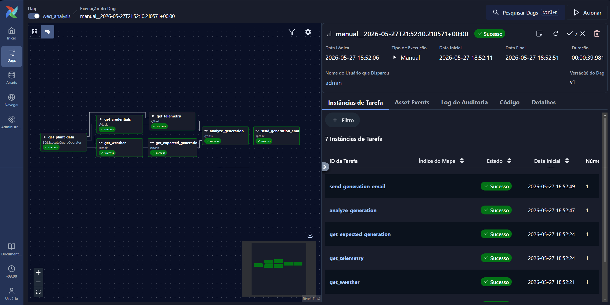

# Solar-Analysis

Solar-Analysis is an Apache Airflow repository that automates the daily performance analysis of WEG-connected solar plants. Its purpose is to help plant owners and operators detect underperformance without manually checking inverter portals, weather conditions, and expected production calculations every day.

The repository contains the `weg_analysis` DAG, a scheduled workflow that turns plant registration data, encrypted vendor credentials, real WEG telemetry, weather conditions, and irradiance data into a practical generation report. It estimates how much each plant should have generated, compares that estimate with the measured output, calculates the operational and financial gap, uses an LLM reporting step to summarize the result, and sends the final report by email.

This repository is not the full Apolo platform. It is the monitoring and reporting layer that makes the platform more proactive: instead of only storing or displaying solar data, it identifies generation deviations and converts them into a daily operational signal that can guide maintenance, support, and customer communication.

## What The DAG Does

The active DAG is defined in [`Airflow/dags/get_telemetry.py`](Airflow/dags/get_telemetry.py). It is scheduled to run daily, does not backfill old runs, and uses the Airflow logical date to analyze the previous calendar day.

At a high level, the workflow has two branches after plant loading:

- the telemetry branch retrieves credentials and real WEG power readings;
- the weather branch retrieves irradiance and weather inputs and estimates expected generation.

Those branches are joined by the analysis task, then the reporting stage prepares the generation report and the final task sends the email.

## Tasks

| Task | What it does |
| --- | --- |
| `get_plant_data` | Loads the WEG plant records and analysis inputs from Postgres, including plant names, locations, coordinates, area, module efficiency, orientation, vendor identifiers, and encrypted vendor credentials. |
| `get_credentials` | Decrypts the vendor credentials returned by `get_plant_data` so the workflow can access the WEG telemetry API. |
| `get_telemetry` | Retrieves the real WEG telemetry for each plant for the target day, using 15-minute active power measurements as the basis for measured generation. |
| `get_weather` | Retrieves the target day's weather and irradiance data for each plant location, including solar radiation, temperature, wind, clouds, rain, and related daily weather fields. |
| `get_expected_generation` | Converts each plant's weather, irradiance, location, area, efficiency, tilt, azimuth, and loss assumptions into an expected daily generation value in kWh. |
| `analyze_generation` | Compares measured generation against expected generation, applies the accepted tolerance range, marks whether each plant is within range, and calculates estimated energy and financial loss. |
| `generate_llm_report` | Uses the analysis results to produce an objective report for the plant owner, highlighting generation deviations, estimated kWh loss, and financial impact. |
| `send_generation_email` | Sends the daily HTML generation report with measured generation, expected generation, normal range, status, and estimated loss for each analyzed plant. |

## DAG Shape

The Airflow run shown in the prompt executes the solar analysis flow from plant loading through telemetry, weather, expected generation, analysis, LLM reporting, and email delivery:

`get_plant_data -> get_credentials -> get_telemetry -> analyze_generation -> generate_llm_report -> send_generation_email`

and

`get_plant_data -> get_weather -> get_expected_generation -> analyze_generation -> generate_llm_report -> send_generation_email`

## Main Files

| Path | Purpose |
| --- | --- |
| [`Airflow/dags/get_telemetry.py`](Airflow/dags/get_telemetry.py) | Defines the `weg_analysis` DAG and all active workflow tasks. |
| [`Airflow/Dockerfile`](Airflow/Dockerfile) | Builds the Airflow container used to run the DAG. |
| [`Airflow/docker-entrypoint.sh`](Airflow/docker-entrypoint.sh) | Starts Airflow in the deployed environment. |
| [`Airflow/requirements.txt`](Airflow/requirements.txt) | Lists the Python packages required by the Airflow runtime and DAG. |
| [`output/pdf/relatorio-dag-weg-analysis-apolo.pdf`](output/pdf/relatorio-dag-weg-analysis-apolo.pdf) | Contains the source report that documents the business and technical context for this DAG. |
